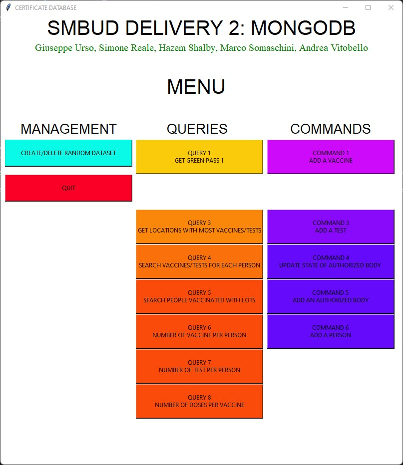

  
   
  <i>
  	Systems and Methods for Big and Unstructured Data - Delivery #2 - AA 2021/2022 - Prof. Marco Brambilla
  </i>

<h1 align="center">
	<strong>
	COVID Certification App
	</strong>
	 
</h1>

		
		
		 			
		<a href="https://www.mongodb.com/">MongoDB</a>		 
		•		
		<a href="report/report.pdf">Report</a>   
	

A GUI application that keeps track of vaccinations and tests of the users and provides ceritifcation as QR codes. Powered by the document-based storage system of MongoDB. 

## Features
* **Retrieve** your vaccine/test certification
* **Analyse** and automatically retrieve info like:
    * Locations with the most vaccinations/tests done
    * Statistics about the vaccines
* **Manage** the database with the integrated commands

## Video Tutorial
Check out the following youtube video to see the application in action!

## Visuals

  

  

## Authors
*Reale Simone*

*Shalby Hazem*

*Somaschini Marco*

*Urso Giuseppe*

*Vitobello Andrea*